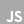

# Hi 👋, i am Darkcom.
## Backend Developer Python | Game Developer Hobbist

[imágen]

# About me

I started programming in 2010 by **developing video games in Unity**; I built up a large *"graveyard"* of projects until my laptop's power and my eyesight could no longer keep up. In 2018, I began programming in **Python**, which has since become my main language. I've developed small tools that make my daily life easier. For many years, I** was a blogger** until my website was hacked; I hope to revive it someday. Currently, I am preparing to become a **Backend Developer**.

# Technologies

# Github Analitics

