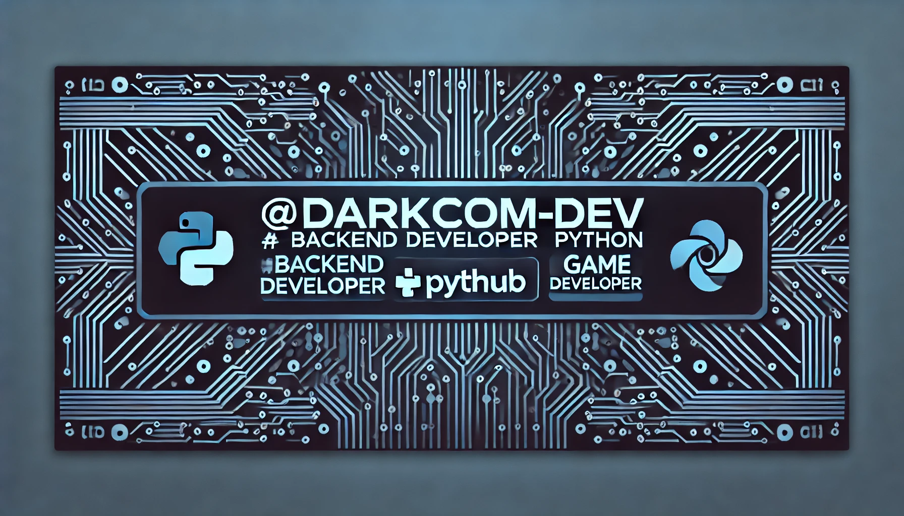

# Hi 👋, i am Darkcom.
## Backend Developer Python | Game Developer Hobbist

# About me

I'm Darkcom — a Game Dev Tools Maker & 3D Modeler (Anime/Manga 🎌, animation enthusiast). Since 2010 I build optimized 3D assets & tools for indie devs on mobile, mobile VR and low-resource devices, balancing visual quality with performance. Grab my assets ↓ darkcom.dev

# Technologies

# Github Analitics

